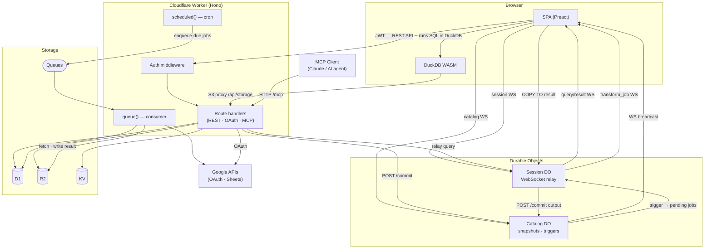

```mermaid
flowchart TB
    subgraph Client["Browser"]
        SPA["SPA (Preact)"]
        DUCKDB["DuckDB WASM"]
    end

    subgraph Worker["Cloudflare Worker (Hono)"]
        AUTH["Auth middleware"]
        ROUTES["Route handlers\n(REST · OAuth · MCP)"]
        SCHED["scheduled() — cron"]
        QUEUE_C["queue() — consumer"]
    end

    subgraph DOs["Durable Objects"]
        SESSION["Session DO\nWebSocket relay"]
        CATALOG["Catalog DO\nsnapshots · triggers"]
    end

    subgraph Storage["Storage"]
        D1[("D1")]
        R2[("R2")]
        KV[("KV")]
        Q(["Queues"])
    end

    MCP_CLIENT["MCP Client\n(Claude / AI agent)"]
    GOOGLE["Google APIs\n(OAuth · Sheets)"]

    %% Browser ↔ Worker
    SPA -- "JWT — REST API" --> AUTH
    AUTH --> ROUTES
    ROUTES --> D1

    %% Browser WebSockets
    SPA -- "catalog WS" --> CATALOG
    SPA -- "session WS" --> SESSION

    %% DuckDB ↔ Storage via proxy
    DUCKDB -- "S3 proxy /api/storage" --> ROUTES
    ROUTES --> R2
    ROUTES --> KV

    %% MCP
    MCP_CLIENT -- "HTTP /mcp" --> ROUTES
    ROUTES -- "relay query" --> SESSION
    SESSION -- "query/result WS" --> SPA
    SPA -- "runs SQL in DuckDB" --> DUCKDB

    %% Catalog commit flow
    ROUTES -- "POST /commit" --> CATALOG
    CATALOG -- "WS broadcast" --> SPA
    CATALOG -- "trigger → pending jobs" --> SESSION
    SESSION -- "transform_job WS" --> SPA
    SPA -- "COPY TO result" --> SESSION
    SESSION -- "POST /commit output" --> CATALOG

    %% Scheduling & queues
    SCHED -- "enqueue due jobs" --> Q
    Q --> QUEUE_C
    QUEUE_C -- "fetch · write result" --> R2
    QUEUE_C --> D1
    QUEUE_C --> GOOGLE
    ROUTES -- "OAuth" --> GOOGLE
```
